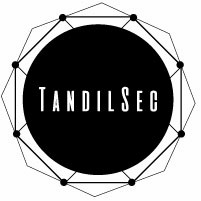

# Publicaciones

Este repositorio contiene publicaciones dadas por [TandilSec](https://www.meetup.com/TandilSec/).

## 2016

* [Debate sobre Voto Electrónico: Antecedentes y Proyecciones (2016/11/25)](voto-electronico/README.md)

## 2017

* [Primera jornada de charlas - Contenedores (2017/03/18)](charlas-2017-marzo/README.md)
* [FliSol Tandil 2017 - Comunicaciones seguras (2017/04/22)](comunicaciones-seguras/README.md)
* [FliSol Tandil 2017 - Hackaton de Datos Abiertos (2017/04/22)](https://github.com/TandilSec/hackathon-flisol2017)
* [Segunda jornada de charlas (2017/11/18)](charlas-2017-noviembre/README.md)

## 2018

* [FliSol Tandil 2018 - Hackaton de Datos Abiertos (2017/05/05)](https://github.com/TandilSec/hackathon-flisol2018)
* [Tercer jornada de charlas (2018/10/06)](charlas-2018-octubre/README.md)
