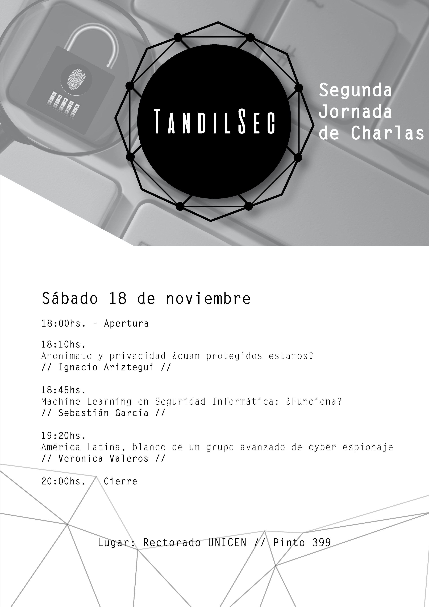

# Segunda Jornada de charlas TandilSec

El 18 de Marzo de 2017 realizamos la segunda jornada de charlas de TandilSec.

## Anonimato y privacidad ¿cuan protegidos estamos?

Deep web, Darknet, Dark Web: diferentes pero con ciertas características que los relacionan.

**Ignacio Ariztegui** *es entusiasta de la seguridad informática, miembro de TandilSec y generalmente no accede a ninguna Web si no es usando Tor o alguna otra red de anonimato.*

## Machine Learning en Seguridad Informática: Funciona?

Muchos son los mitos y dudas de machine learning en seguridad. Funciona de verdad? Cómo implementarlo? Qué soluciona? En esta charla te contamos las técnicas más usadas en la industria, las falencias, los aciertos y las oportunidades a futuro. Discutiremos qué diferencia esta disciplina de otras al usar machine learning y como sortear los obstáculos. Cerramos contándote del proyecto Stratosphere IPS. El primer sistema de detección de intrusiones de red, free software, basado solamente en machine learning.

Destinado a quienes se quieran meter en machine learning en seguridad y no sepan como empezar.

* [Presentación](https://slides.com/eldraco/machine-learning-en-seguridad-funciona/)

**Sebastián García** *es un investigador especializado en Malware y profesor en seguridad informática. Obtuvo su Ph.D de la UNICEN en la detección de botnets y malware en la red mediante el análisis de sus patrones de comportamiento usando Machine Learning. Como investigador en el Artificial Intelligence Center (AIC) de la Czech Technical University en Praga el cree que el uso de Free Software y Machine Learning puede ayudar a proteger mejor a los usuarios de los abusos de sus derechos digitales. Ha enseñando en varios países y universidades alrededor del mudo y ha trabajado como penetration tester tanto para compañías como para gobiernos. Como co-fundador del hackspace Mateslab cree en el poder de ensenarse a uno mismo. Ha trabajado con honeypots, deteccion de malware, scanning distribuido (dnmap), keystroke dynamics, analysis de bluetooth, protección de la privacidad, deteccion de intrusos, robótica y biohacking.*

*En la Universidad CTU es el director del Stratophere IPS Project, donde desarrollan un sistema free software de deteccion de intrusiones basado en machine learning.*

* [@eldracote](https://twitter.com/eldracote)
* https://www.researchgate.net/profile/Sebastian_Garcia6
* http://stratosphereips.org

## America Latina, blanco de un grupo avanzado de cyber espionaje

Desde el 2010, un grupo de cyber espionaje conocido como Machete ha cobrado mas de 700 víctimas en gobiernos, embajadas e instituciones militares de América Latina. En esta charla, te cuento la investigación que realizamos sobre las últimas campañas de El Machete. Vení a enterarte como opera, como funciona el malware, y los trucos que han implementado en los últimos meses.

**Verónica Valeros** *es hacker e investigadora en seguridad informática de Argentina. Su investigación ha tenido un fuerte foco en ayudar a gente e involucra diversas áreas, desde problemas de privacidad wireless y bluetooth hasta malware, botnets y análisis de intrusiones.*

*Presentó sus investigaciones en conferencias internacionales como BlackHat, EkoParty, Botconf, Troopers y otras. Desde 2017, participa en el comité revisor de varios conferencias, incluyendo BlackHat EU.*

*Es fundadora del HackerSpace MatesLab de Mar del Plata. Es también parte del equipo principal de Security Without Borders, un colectivo de profesionales de la seguridad informática voluntarios que asisten a ONGs y gente en riesgo con problemas relacionados con la ciber seguridad.*

*Desde 2013 es parte del equipo Cognitive Threat Analytics (Cisco Systems) donde se especializa en análisis de tráfico de malware y categorización de amenazas a gran escala.*

* [@verovaleros](https://twitter.com/verovaleros)
* https://www.veronicavaleros.com/

