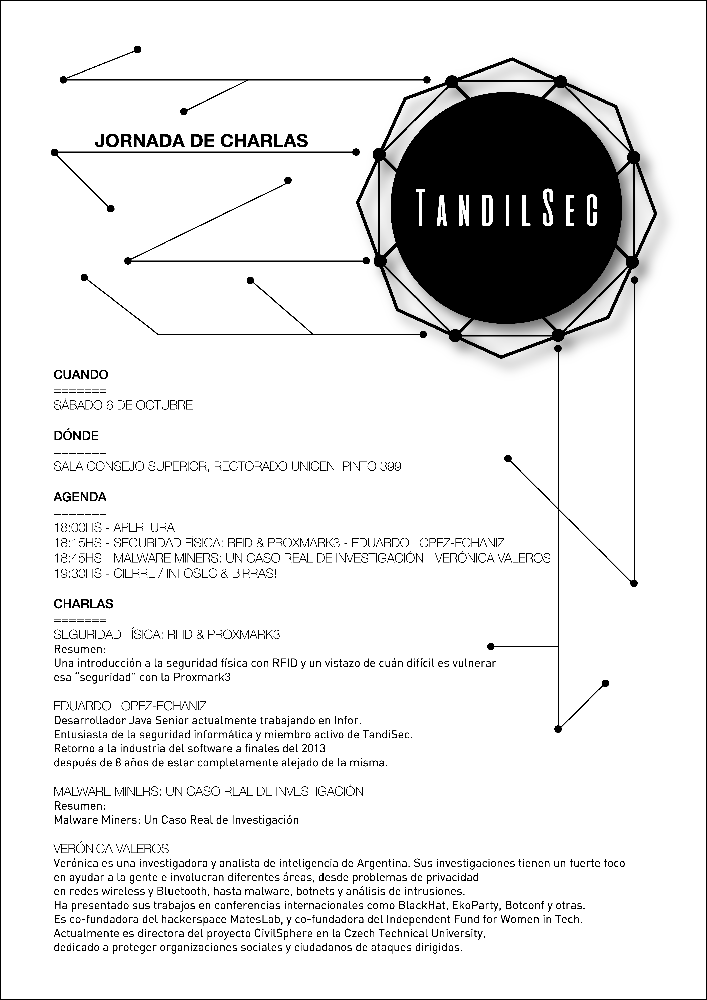

# Tercer Jornada de charlas TandilSec

El 6 de Octubre de 2018 realizamos la tercer jornada de charlas de TandilSec.

## Seguridad física: RFID & Proxmark3

Una introducción a la seguridad física con RFID y un vistazo de cuán difícil es vulnerar esa “seguridad” con la Proxmark3

_**Eduardo Lopez-Echaniz** Desarrollador Java Senior actualmente trabajando en Infor. Entusiasta de la seguridad informática y miembro activo de TandiSec. Retorno a la industria del software a finales del 2013 después de 8 años de estar completamente alejado de la misma._

* [@Kissaki07](https://twitter.com/Kissaki07)

## Malware Miners: Un Caso Real de Investigación

_**Verónica Valeros** Veronica es una investigadora y analista de inteligencia de Argentina. Sus investigaciones tienen un fuerte foco en ayudar a la gente e involucran diferentes áreas, desde problemas de privacidad en redes wireless y Bluetooth, hasta malware, botnets y análisis de intrusiones. Ha presentado sus trabajos en conferencias internacionales como BlackHat, EkoParty, Botconf y otras. Es co-fundadora del hackerspace MatesLab, y co-fundadora del Independent Fund for Women in Tech. Actualmente es directora del proyecto CivilSphere en la Czech Technical University, dedicado a proteger organizaciones sociales y ciudadanos de ataques dirigidos._

* [@verovaleros](https://twitter.com/verovaleros)
* https://www.veronicavaleros.com/

