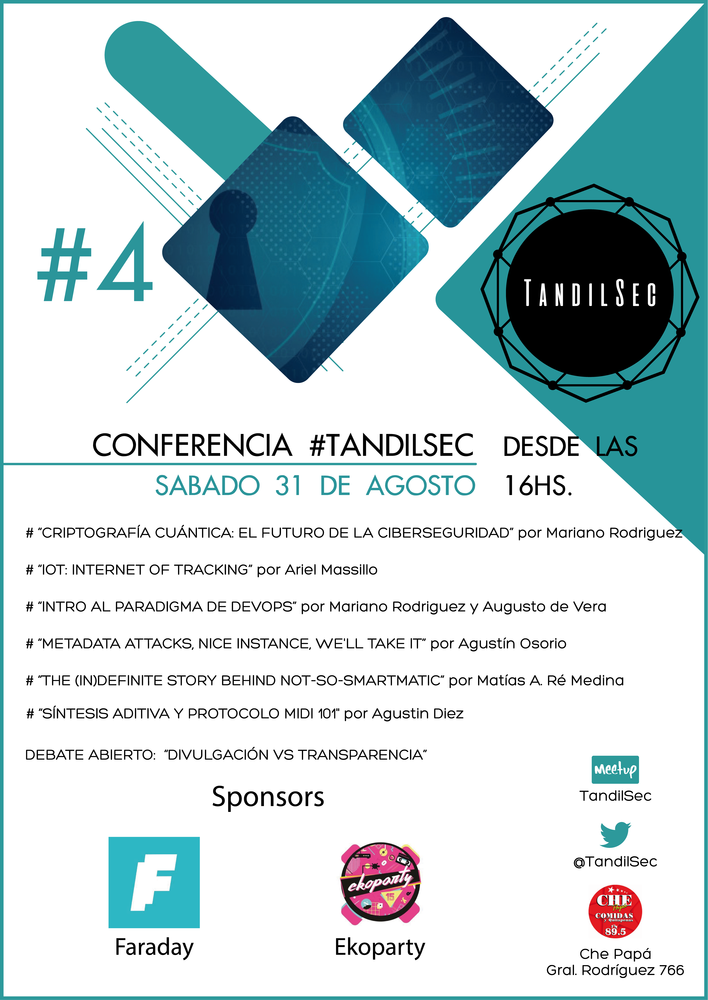

# Conferencia TandilSec #4

El 31 de Agosto de 2019 realizamos una nueva jornada de charlas, esta vez con formato conferencia.

## Charlas y actividades:

- [“Criptografía cuántica, el futuro de la Ciberseguridad”](CriptoCuantica.odp) por [Mariano Rodriguez](https://twitter.com/martemars)
- [“IoT: Internet of Tracking”](IoT-Internet-of-Tracking.odp) por [Ariel Masillo](https://twitter.com/ArielMasillo)
- “Intro al paradigm de DevOps” por [Mariano Rodriguez](https://twitter.com/martemars) y Augusto de Vera
- [“Metadata Attacks, nice instance, we'll take it”](MetaData-Attack-nice-instance-well-take-it.pdf) por [Agustín Osorio](https://twitter.com/AgustnOsorio4)
- "Síntesis aditiva y protocolo MIDI 101" por Agustín Diez
- ["The (in)definite Story Behind Not-So-Smartmatic"](The-in-definite-story-behind-not-so-SmartMatic.pdf) por [Matías A. Ré Medina](https://twitter.com/mattaereal)
- Debate Abierto: "Divulgación vs Transparencia"

---

### Asociaciones acompañantes

Contamos con el apoyo de: 🥰

- [Faraday Security](https://www.faradaysec.com/)
- [EkoParty Security Conference](https://www.ekoparty.org/)
- [Che Papá](https://www.facebook.com/ChePapaTandil/)

---

