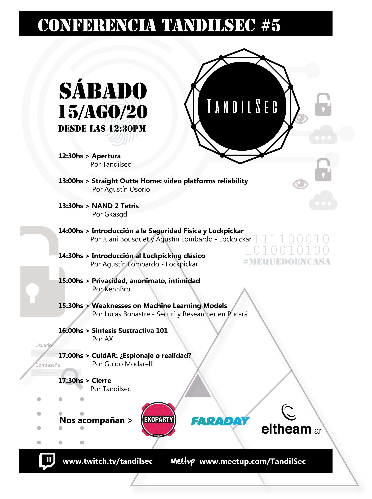

# Conferencia TandilSec #5

El 15 de Agosto de 2020 realizamos una nueva conferencia, esta vez remota!

## Charlas y actividades:

- ["Straight Outta Home: video platforms reliability"](Straight-Outta-Home.pptx) por Agustín Osorio
- [“NAND 2 Tetris”](NAND-2-Tetris-TandilSec-Talk.pptx) por Gkasgd
- “Introducción al lockpicking clásico”, por Juani Bousquet y Agustín Lombardo de LockPickAR
- “Introducción a la seguridad física y Lockpickar” por Juani Bousquet y Agustín Lombardo de LockPickAR
- "Privacidad, anonimato, intimidad" por KennBro
- "Weaknesses on Machine Learning Models" por Lucas Bonastre, Security Researcher en [Pucara Information Security](https://www.pucarasec.com/)
- “Síntesis Sustractiva 101” por AX
- ["CuidAR: ¿Espionaje o realidad?"](CuidAR.pptx) por Guido Modarelli

---

### Asociaciones acompañantes

Contamos con el apoyo de: 🥰

- [EkoParty Security Conference](https://www.ekoparty.org/)
- [Faraday Security](https://www.faradaysec.com/)
- [ElTheam.ar](https://eltheam.ar/)
- AnonUser#1337

### Agradecimientos

- ¡A las organizaciones que nos acompañaron!
- Eugenia de [Siento Diseño](mailto:sientodiseno@gmail.com), por la ayuda con las gráficas. ¡Gracias!
- A los speakers, tanto los propios de TandilSec como a los de comunidades amigas.
- @Gkasgd que hizo la operación durante el backup, y @NachoR como operador backup.
- @verovaleros por siempre acompañar a la distancia y ser un modelo para la comunidad!

---

