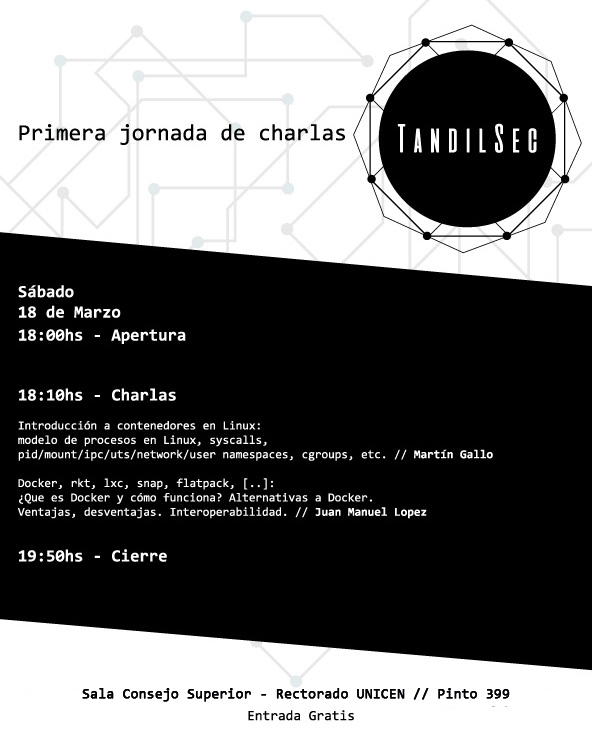

# Primera Jornada de charlas TandilSec

El 18 de Marzo de 2017 realizamos la primera jornada de charlas de TandilSec. La
temática fue tecnologías de contenedores y su aplicación tanto a seguridad como
a DevOps y otros ámbitos.

## Introducción a contenedores en Linux

Modelo de procesos en Linux, syscalls, pid/mount/ipc/uts/network/user
namespaces, cgroups, etc. - *Martín Gallo*

* [Presentación](TandilSec-Contenedores.pdf)
  ([pdf](TandilSec-Contenedores.pdf)/[opd](TandilSec-Contenedores.opd))
* [Códigos de ejemplo](src/)
  * [01 - Creación de un namespace de archivos](src/01-nuevo-namespace-mount.c)
  * [02 - Unirme a un namespace existente](src/02-unirme-namespace.c)
  * [03 - Creación de un "contenedor"](src/03-contenedor.c)

## Docker, rkt, lxc, snap, flatpack, [..]

¿Que es Docker y cómo funciona? Alternativas a Docker. Ventajas, desventajas.
Interoperabilidad. - *Juan Manuel Lopez*

* [Presentación](XXX.pdf) ([pdf](XXX.pdf)/[opd](XXX.opd))

